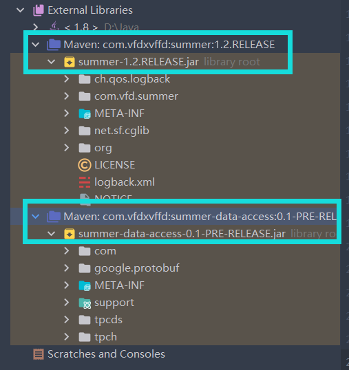
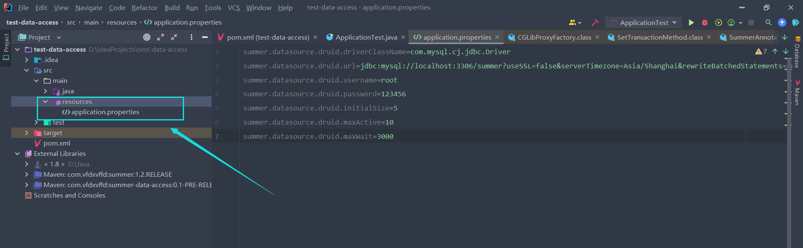

# summer-data-access

[](https://github.com/vfdxvffd/summer-data-access/releases/tag/v0.1)

> ​		summer-data-access，适配到summer的数据访问模块，旨在可以通过注解快速的解决数据库访问的问题，采用`druid`数据源做连接池可以支持配置化的修改连接池相关配置。在`0.1-PRE-RELEASE`版本中做了`mysql`相关的处理以及事务的相关处理，可以使用注解更加方便的配置事务，后面会根据需要慢慢加入更多的数据库。


## 版本适配

| summer                                                       | summer-data-access                                           |
| ------------------------------------------------------------ | ------------------------------------------------------------ |
| [](https://github.com/vfdxvffd/Summer/releases/tag/v1.2) | [](https://github.com/vfdxvffd/summer-data-access/releases/tag/v0.1) |

## 快速开始(Quick Start)

### 加入依赖

对照上述版本适配表导入相关依赖




### 加入相关配置

在项目中加入配置文件，主要配置项可参考`druid`配置方式，不过要在配置的`key`前加入`summer.datasource.druid.`前缀如下所示:

```properties
summer.datasource.druid.driverClassName=com.mysql.cj.jdbc.Driver
summer.datasource.druid.url=jdbc:mysql://localhost:3306/database...
summer.datasource.druid.username=root
summer.datasource.druid.password=123456
summer.datasource.druid.initialSize=5
summer.datasource.druid.maxActive=10
summer.datasource.druid.maxWait=3000
```



### 编写Hello World测试

​		访问数据库的数据访问接口，只是写接口不用写实现，将每个方法要执行的对应的sql语句使用注解标注在对应方法上即可，使用`@Data`注解标注这个接口是我们用来访问数据库的。

​		根据方法执行的sql语句类型不同使用对应的注解如`@Insert`、`@InsertPojo`、`@Delete`、`@Update`。对于这四种返回结果为int，表示这次sql语句修改的记录数，也可以用boolean类型来接受。若修改记录数大于0则返回true，否则返回false。

​		特别地，对于插入，`@Insert`、`@InsertPojo`提供了批量插入的操作，通过指定注解中`mutiply = true`来表示此次为批量插入，入参需要是批量插入数据的数组，若插入为普通数据，则以二维数组传递数据，若插入为pojo，则传入pojo的数组形式（下面会给示例）。

​		而对于查询给出了三种方式：

* `@Select`: 查询的结果为基础类型int、double、float、long、String
* `@SelectMaps`: 查询的结果为数据库输出所有结果的List，List里每一条对应一行数据，List里面包了一层Map，Map的key是列名，value是对应的值
* `@SelectPojo`: 需要有对应查询结果的pojo，或者VO，将数据库输出结果的每个字段值映射到pojo的对应的属性

查询的返回结果，如果接口方法使用List，则返回List，否则只返回查询到的第一条数据。

​		对于事务，通过`@Transaction`注解来使用，通常在某个service的方法里调用了多条mapper里执行sql语句的方法，若要使这些sql语句在一个事务里执行，只需要在对应的service的方法上标注`@Transaction`注解。

​		若一个service方法调用了其他service的事物方法，之就表示可能会有事务的嵌套结构出现，可以通过指定`@Transaction`注解中的参数`withAnotherConn = true or false`来表示是开启一个新的事务连接来执行还是沿用父事务的连接来执行，如果在一个service里的事务方法需要调用另一个事务方法，且需要开启一个新的连接，则需要在service中注入本身service对象再调用。


1. 先编写`pojo`，eg: Student

```java
@Table								// 标注这是一个pojo
public class Student {

    @Mapping(from = "id")			// 将查询到的返回的id字段映射到Student的id属性
    private int id;

    @Mapping(from = "name")
    private String name;

    @Mapping(from = "age")
    private int age;

    @Mapping(from = "grade")
    private int grade;

    @Mapping(from = "sex")
    private int sex;
}
```

2. 数据库的数据访问接口

```java
@Data											// 标识此接口为数据访问接口，不需要写实现类
public interface StudentMapper {

    // 插入数据， 占位符需要和参数对应，后续还要修改的更加人性化
    @Insert(sql = "insert into student value (?,?,?,?,?)")
    int insertStudent (int id, String name, int age, int grade, int sex);

    // 删除数据， 同上
    @Delete(sql = "delete from student where id = ?")
    int deleteStudent (int id);

    // 修改数据，同上
    @Update(sql = "update student set age = ? where id = ?")
    int updateStudent (int age, int id);

    // 查询数据，返回基础类型，如果多条数据也可以写为 List<Integer> getXXX ();
    @Select(sql = "select count(*) from student", resultType = int.class)
    int getStudentCount ();

    // 查询返回pojo；如果只有一条可以写作Student getStudent ();，但这种写法如果结果有多条就返回第一条
    @SelectPojo(sql = "select * from student", pojo = Student.class)
    List<Student> getAllStudent ();

    // 将查询返回结果的列名和值以Map形式，多条记录对应多个Map装在List里面返回
    @SelectMaps(sql = "select * from student")
    List<Map<String, Object>> getAllData ();

    default void show () {
        System.out.println("这是一个默认方法");
    }
}
```

3. 服务调用数据接口

```java
// 只是简单调用数据接口
@Service
public class StudentService {

    @Autowired
    StudentMapper studentMapper;

    int insertStudent (int id, String name, int age, int grade, int sex) {
        return studentMapper.insertStudent(id, name, age, grade, sex);
    }

    int deleteStudent (int id) {
        return studentMapper.deleteStudent(id);
    }

    int updateStudent (int age, int id) {
        return studentMapper.updateStudent(age, id);
    }

    int getStudentCount () {
        return studentMapper.getStudentCount();
    }

    List<Student> getAllStudent () {
        return studentMapper.getAllStudent();
    }

    List<Map<String, Object>> getAllData () {
        return studentMapper.getAllData();
    }
}
```

4. 写好相关服务后，测试是否work

```java
public class ApplicationTest {

    public static void main(String[] args) throws Exception {

        /**
         * @propertyFile: 配置文件路径
         * @extensions： 所有扩展工具类的集合，这里测试数据访问模块，所以只使用DataAccess类的实例
         * @basePackages： 容器扫描的包，如果有多个包需要管理，可以传入多个，此参数为可变参数 String... basePackages
         */
        SummerAnnotationConfigApplicationContext context = new SummerAnnotationConfigApplicationContext(
                "/application.properties", Arrays.asList(DataAccess.class.newInstance()), "test");

        // 拿到服务类bean
        StudentService studentService = context.getBean(StudentService.class);

        System.out.println(studentService.insertStudent(6, "liliu", 18, 10, 1));
        System.out.println(studentService.updateStudent(20, 6));
        System.out.println(studentService.deleteStudent(7));
        System.out.println(studentService.getAllStudent());
        System.out.println(studentService.getAllData());
        System.out.println(studentService.getStudentCount());
    }
}
```

#### 批量插入

```java
/***********************************for normal data*************************************************/
// for mapper
@Insert(sql = "insert into student (id, name, age, grade, sex) values (?,?,?,?,?)", mutiply = true)
int insertDatas (Object[][] datas);

// for service
public int insertDatas (Object[][] datas) {
    return studentMapper.insertDatas(datas);
}

// when call
StudentService studentService = context.getBean(StudentService.class);	// 拿到服务类bean

System.out.println(studentService.insertDatas(
    new Object[][]{
        new Object[]{1, "zhangsan", 16, 10, 1},
        new Object[]{2, "lisi", 17, 11, 1},
        new Object[]{3, "wangwu", 17, 11, 0}
    }
));


/*********************************for pojo**************************************************************/
// for mapper
@InsertPojo(sql = "insert into student (id, name, age, grade, sex) values (?,?,?,?,?)", mutiply = true, pojo = Student.class)
int insertPojos (Student[] pojos);

// for service
public int insertPojos (Student[] students) {
    return studentMapper.insertPojos(students);
}

// for call
StudentService studentService = context.getBean(StudentService.class);

System.out.println(studentService.insertPojos(
    new Student[]{
        new Student(1, "zhangsan", 16, 10, 1),
        new Student(2, "lisi", 17, 11, 1),
        new Student(3, "wangwu", 17, 11, 0)
    }
));
```

